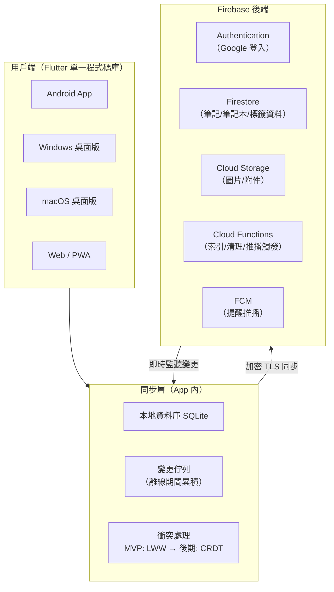
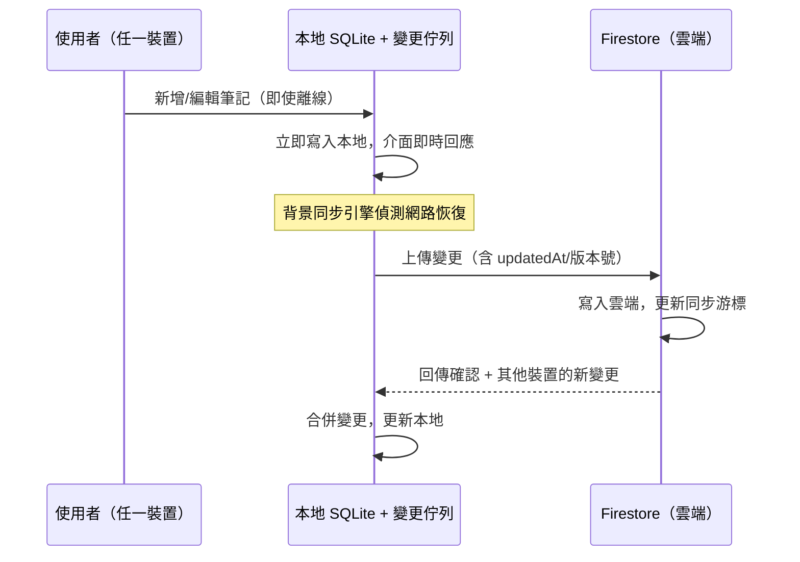

# Evernote 類似 App 建置建議報告

> 版本：v1.0 ｜ 日期：2026-10-05 ｜ 性質：需求規劃與技術選型建議（供決策參考，非正式開發規格書）

---

## 1. 專案摘要

**目標**：建置一個功能定位類似 Evernote 的筆記應用程式（以下簡稱「本 App」），可安裝於 Android 手機，同時跨平台支援 Windows／macOS 電腦與網頁版；以 Google 帳號登入，並在多裝置之間即時同步筆記資料。

**建議主軸**（詳見第 4 章）：

| 項目 | 建議 | 一句話理由 |
| --- | --- | --- |
| 前端框架 | **Flutter** | 一套程式碼涵蓋 Android／iOS／Windows／macOS／Web，跨平台一致性與效能佳 |
| 後端平台 | **Firebase**（Firestore + Auth + Storage + FCM） | 離線同步是筆記 App 的命脈，Firestore 是市場上最成熟的離線優先同步後端 |
| 登入方式 | **Google 登入**（Firebase Authentication 內建 Google 供應商） | 與需求完全吻合，開發量最小、安全性有官方保障 |
| 交付策略 | **MVP 先行**（12–16 週上架） | 先驗證核心價值（筆記＋同步），再逐步加進階功能 |

**核心商業邏輯**：本 App 與一般 App 最大的不同在於**「離線優先（offline-first）」**——使用者斷網時仍能完整閱讀、編輯、新增筆記，恢復連線後自動同步。這直接決定後端選型與同步引擎的設計，是本報告最重要的技術判斷依據。

---

## 2. 需求分析

### 2.1 功能需求清單（分階段）

| 模組 | MVP（第一階段） | 第二階段（發布後 3–6 個月） | 說明 |
| --- | --- | --- | --- |
| 筆記本管理 | ✅ 建立／刪除／重新命名／排序 | 巢狀階層、智慧型筆記本（依條件自動分類） | 對應 Evernote 的「記事本」 |
| 筆記編輯 | ✅ 富文本（標題、粗斜體、清單、待辦、分隔線） | Markdown 模式、表格、程式碼區塊 | 編輯器為核心體驗 |
| 附件與圖片 | ✅ 圖片（拍照／相簿）、一般檔案 | OCR 文字辨識、PDF 預覽、語音筆記 | 檔案走雲端 Storage |
| 標籤系統 | ✅ 標籤建立／指派／篩選 | 多標籤、標籤管理頁 | 對應 Evernote 標籤 |
| 全文搜尋 | ✅ 離線 FTS（SQLite FTS5）+ 伺服端關鍵字搜尋 | 語意搜尋、OCR 內容搜尋 | 筆記 App 的關鍵差異點 |
| 垃圾桶 | ✅ 刪除進垃圾桶、30 天內還原 | 永久清除排程 | 防止誤刪 |
| 離線編輯 | ✅ 完整離線操作 | — | 見第 5 章同步設計 |
| 多裝置同步 | ✅ Android＋Windows＋Web | macOS、iOS | Google 帳號為錨點 |
| 登入 | ✅ Google 登入 | 帳號合併、登出遠端清除 | 見第 6 章 |
| 提醒 | ❌ | ✅ 筆記到期提醒（FCM 推播） | |
| 分享與協作 | ❌ | ✅ 唯讀／可編輯分享連結 | 牽涉權限模型，放後期 |
| 端到端加密 | ❌ | ✅（選項） | 影響全文搜尋，需權衡，見第 9 章 |

### 2.2 非功能性需求

| 項目 | 目標值 | 說明 |
| --- | --- | --- |
| 離線可用性 | 斷網下所有讀寫功能可用 | 不可因網路狀態鎖住功能 |
| 同步延遲 | 正常網路下 < 2 秒 | 變更上傳與他端接收 |
| 冷啟動 | < 2 秒（中階手機） | Flutter 原生編譯可達 |
| 捲動流暢度 | 60fps | 長筆記列表、編輯器捲動 |
| 隱私合規 | 符合台灣《個人資料保護法》 | 見第 9 章 |
| 安裝包體積 | Android APK 約 25–40MB 起 | Flutter 空殼約 12MB 起 |

---

## 3. 系統架構建議

### 3.1 總體架構

**設計原則**：**本地優先（local-first）**——手機／電腦的 SQLite 是使用者資料的「第一真相來源」，雲端是同步中樞與備援。所有寫入先落本地、立即回應使用者，再由同步引擎上傳，這正是 Evernote 使用者體驗的核心。

### 3.2 資料模型（Firestore 集合）

| 集合 | 主要欄位 | 說明 |
| --- | --- | --- |
| `users` | googleUid、email、displayName、createdAt | 以 Google 帳號建立 |
| `notebooks` | ownerId、name、sortOrder、parentId（後期階層） | 筆記本 |
| `notes` | ownerId、notebookId、title、content（富文本 JSON）、tags[]、updatedAt、version、deletedAt | 筆記主體 |
| `tags` | ownerId、name、color | 標籤 |
| `attachments` | ownerId、noteId、storagePath、mimeType、size | 檔案與圖片 |
| `sync_metadata` | deviceId、lastSyncCursor | 每台裝置的同步游標 |

> 建議：`notes` 使用「欄位層級時間戳」記錄 `contentUpdatedAt` 等，作為衝突處理依據（見第 5 章），避免整篇覆蓋。

---

## 4. 技術選型建議

### 4.1 前端框架比較

| 評估維度 | **Flutter**（建議） | React Native | Kotlin Multiplatform |
| --- | --- | --- | --- |
| 支援平台 | Android／iOS／Web／Windows／macOS／Linux（官方穩定） | Android／iOS 為主；桌面與 Web 需第三方方案 | Android／iOS 為主；桌面仍需各別 UI 層 |
| 程式碼重用率 | 約 90%（跨五大平台） | 約 80%（主要 Android／iOS） | 共用邏輯層，UI 需分平台 |
| 渲染效能 | 自繪引擎（Impeller），中階機可穩定 60fps | 橋接原生元件，複雜 UI 偶有掉幀 | 原生效能，但開發量最大 |
| UI 一致性 | 跨平台像素級一致（品牌感強） | 偏向各平台原生觀感 | 各平台原生觀感 |
| 學習曲線 | 需學 Dart（新團隊從零開始無包袱） | 熟 JavaScript／React 的團隊上手最快 | 需熟 Kotlin＋各平台 UI |
| 2026 市場定位 | 多數跨平台專案（約 8 成）的首選 | 適合 JS 技術棧團隊與熱更新需求 | 大型原生團隊優化效能用 |

**結論**：**選 Flutter**。你的需求是「Android 為主＋電腦跨平台＋同步一致體驗」，Flutter 是唯一一套程式碼同時官方支援 Android、Windows、macOS、Web 的框架；若未來團隊以 JS 開發者為主，才回頭考慮 React Native。

### 4.2 後端平台比較

| 評估維度 | **Firebase**（建議） | Supabase | 自建（Node.js＋PostgreSQL） |
| --- | --- | --- | --- |
| 離線同步 | **最成熟**：Firestore 內建離線持久化、寫入佇列、恢復連線自動同步、內建衝突處理 | 原生離線同步支援有限，需自行疊加同步層（如 Electric／Zero） | 全部自行開發（同步協定、衝突處理、重試） |
| 即時同步 | Firestore 監聽（listener）成熟 | Postgres 變更串流（LISTEN/NOTIFY），可用但較年輕 | 自行用 WebSocket 實作 |
| Google 登入 | Firebase Auth 內建，一行設定 | 支援 Google OAuth，需自訂流程 | 需整合 Google Identity Services OAuth 2.0 |
| 自架（Ubuntu） | 不支援（僅 Google Cloud） | **支援**（Docker Compose 自架，符合你的既有維運經驗） | 完全自控 |
| 資料庫型態 | NoSQL（Firestore，無 JOIN） | PostgreSQL（SQL、關聯查詢彈性大） | PostgreSQL |
| 費用模式 | 免費額度（Spark 方案）＋用量計費 | 開源可自架，雲端版另計 | 伺服器＋維運人力 |

**結論**：**主推 Firebase**——離線優先同步是筆記 App 的命脈，而 Firestore 的離線持久化與衝突處理是目前業界公認最成熟的方案，能省下大量自建同步層的開發與測試時間。

> **替代方案（符合你的維運經驗）**：若你希望資料完全自控、跑在自己熟悉的 Ubuntu 環境，可選 **Flutter + Supabase 自架**（Docker Compose），但必須**自行開發同步層**（離線佇列、游標、衝突合併），MVP 時程約增加 4–6 週，需列入風險。

### 4.3 登入方式：Google

| 方案 | 複雜度 | 說明 |
| --- | --- | --- |
| **Firebase Authentication（Google 供應商）**（建議） | 低 | 官方 SDK 一鍵整合，自動處理 token 生命週期；Firestore 安全規則可直接以 `uid` 做資料隔離 |
| Google Identity Services OAuth 2.0 + 自建後端 | 中 | 彈性大，但需自行管理 refresh token、session、資料權限，僅在「不使用 Firebase」時採用 |

### 4.4 推薦技術組合總表

| 層 | 主推方案 | 替代方案 |
| --- | --- | --- |
| 前端 | Flutter（Dart） | React Native（若團隊熟 JS） |
| 本地資料庫 | SQLite（drift 套件，內建 FTS5 全文搜尋） | Hive（輕量但搜尋需另建） |
| 後端 | Firebase（Firestore＋Auth＋Storage＋Functions＋FCM） | Supabase 自架於 Ubuntu |
| 登入 | Firebase Auth（Google） | Google OAuth 2.0 自建 |
| 搜尋 | 離線 SQLite FTS5 + 伺服端索引 | Meilisearch（若自架後端） |
| CI/CD | GitHub Actions / Codemagic | — |
| 錯誤監控 | Firebase Crashlytics + Performance | Sentry |

---

## 5. 同步與離線設計（核心章節）

### 5.1 離線優先流程

### 5.2 衝突處理策略

| 階段 | 策略 | 說明 |
| --- | --- | --- |
| **MVP** | **LWW（最後寫入勝出）+ 欄位層級時間戳** | 同一筆記被兩台裝置編輯時，以「欄位」為單位保留最新版本（如 A 改了標題、B 改了內文，兩者都保留），而非整篇覆蓋；配合版本號與 `deletedAt` 軟刪除（tombstone）避免刪除被覆蓋 |
| 第二階段 | 導入 **CRDT**（如 Yjs） | 支援「同一段文字同時編輯」的自動合併，為未來協作分享鋪路；Yjs 合併延遲約 0.1–2ms，適合文字編輯器 |

> 為什麼 MVP 不用 CRDT：CRDT 實作複雜、資料體積較大；對「單人多裝置」的使用情境，欄位層級 LWW 已能涵蓋 95% 以上的衝突，且實作與測試成本低很多。先用 LWW 上線，再依使用者回饋決定是否升級。

### 5.3 同步設計要點

1. **每台裝置有唯一 `deviceId`**，同步游標（`lastSyncCursor`）以裝置為單位記錄，可追蹤每台裝置的同步狀態。
2. **寫入佇列持久化**：離線期間的變更存於本地佇列，App 重啟不遺失。
3. **背景同步觸發**：連線恢復、App 回到前景、定時（如每 5 分鐘）三種機制。
4. **同步狀態 UI**：筆記列表顯示「已同步／同步中／等待同步」狀態，這是使用者信任同步的關鍵。

---

## 6. 登入與帳號（Google）

1. 使用者點「使用 Google 帳號登入」→ 觸發 Firebase Auth Google 供應商（Android 用 Credential Manager，桌面／Web 用 OAuth 快顯視窗）。
2. 登入成功後取得 `uid`，Firestore 安全規則（Security Rules）以 `request.auth.uid == ownerId` 隔離每位使用者的資料。
3. **Token 安全**：Google／Firebase token 儲存在平台安全儲存區（Android Keystore、Windows Credential Manager、macOS Keychain），不寫入一般檔案。
4. 登出時：清除本機 token、選擇性提供「登出並清除本機筆記快取」選項（企業或公用電腦情境）。
5. 隱私權政策與 Google OAuth 同意畫面需說明取用範圍（僅 email 與基本個人資料）。

---

## 7. 安卓安裝與跨平台發布

### 7.1 Android 安裝策略

| 階段 | 方式 | 說明 |
| --- | --- | --- |
| 開發測試 | APK 側載（簽署 debug/release key） | 直接複製 APK 到手機安裝，需允許「安裝未知來源」 |
| 正式對外 | **AAB 上架 Google Play** | AAB（Android App Bundle）由 Play 依裝置動態產生最佳化 APK；需 25 美元一次性註冊費（個人開發者） |
| 企業／限定對象 | Play Console「內部測試軌」或私人 APK 下載 | 不需公開上架 |

**上架注意**：Google Play 要求提供隱私權政策網址、帳號刪除流程說明（需在 2026 年政策框架下提供「刪除帳號與資料」入口）。

### 7.2 跨平台發布

| 平台 | 發布格式 | 備註 |
| --- | --- | --- |
| Windows | MSIX／EXE 安裝檔 | Flutter 官方支援；可用 Inno Setup 打包 |
| macOS | DMG（需 Apple Developer 簽章與公證） | 僅有 Apple 開發者帳號（年費 99 美元）才需簽章 |
| Web | Flutter Web 靜態網站／PWA | 可部署於自有 Ubuntu 伺服器（Nginx）或 Firebase Hosting |

### 7.3 建議的開發與發布管線

- 程式碼：Git（GitHub 私有倉庫）
- CI/CD：GitHub Actions 或 Codemagic，每次 push 自動建置 Android／Windows／Web 三個產物
- 版本管理：SemVer（如 1.0.0）；**同步引擎的協定版本**需獨立管理，避免舊版 App 與新版後端不相容

---

## 8. 開發時程與預算估算

### 8.1 建議時程（MVP → 正式版）

| 階段 | 期間 | 產出 |
| --- | --- | --- |
| 1. 需求確認與原型設計 | 2 週 | 功能優先序、UI 原型（Figma） |
| 2. MVP 開發（Flutter＋Firebase） | 8–10 週 | Android＋Windows＋Web 可操作版本 |
| 3. 同步引擎測試與修正 | 2–3 週 | 離線／衝突／多裝置情境測試 |
| 4. 上架與發布 | 1–2 週 | Google Play 上架、Windows 安裝檔、Web 部署 |
| **MVP 合計** | **13–17 週（約 3–4 個月）** | |
| 5. 第二階段（提醒／OCR／協作） | 3–4 個月 | 依市場回饋排序 |

### 8.2 人力配置

| 角色 | 人數 | 說明 |
| --- | --- | --- |
| Flutter 開發者 | 1–2 人 | 核心開發（同步引擎＋UI） |
| 後端／DevOps | 0.5–1 人 | Firebase 設定、安全規則、CI/CD（可與 Flutter 開發者兼任） |
| 測試 | 兼職／1 人 | 重點在同步衝突與多裝置情境 |

### 8.3 成本估算

| 項目 | 金額（參考） | 說明 |
| --- | --- | --- |
| 外包開發（對照行情） | MVP 約 **US$40,000–55,000**（4–6 個月） | 2026 年離岸團隊 Flutter MVP 行情 |
| 自建團隊（台灣） | 約 **NT$60,000–90,000／人月** × 3–4 個月 | 視資歷與地區 |
| Firebase 營運成本 | **開發期 $0**（Spark 免費方案）→ 上線後 Blaze 用量計費，個人使用量約 **每月 NT$0–1,500** | 免費額度：Firestore 1GB 儲存／50K 讀／20K 寫／1GB 傳輸／每日，超過才收費 |
| Google Play 註冊費 | 一次性 **US$25** | 個人開發者 |
| Apple 開發者帳號 | 年費 **US$99** | 僅 macOS／iOS 需要 |

> 以上為市場參考行情，實際依功能範圍與團隊報價為準；建議在簽約前以功能清單（第 2 章）逐項估價。

---

## 9. 資料安全與法規

| 項目 | 作法 |
| --- | --- |
| 傳輸安全 | 全站 TLS；Firestore／Storage 預設加密 |
| 靜態加密 | 雲端由 Google 代管加密；本機 SQLite 可用 SQLCipher 加密（進階選項） |
| 存取控制 | Firestore Security Rules 以 `uid` 隔離；附件 Storage 路徑含 `uid` |
| 台灣個資法 | 提供隱私權政策、蒐集範圍說明（email、名稱、筆記內容）；支援使用者「匯出與刪除全部資料」請求 |
| Google Play 政策 | 需提供隱私權政策網址、帳號刪除入口 |
| 端到端加密（E2EE，後期選項） | 用使用者密碼衍生的金鑰加密筆記內容；**注意**：E2EE 後伺服端無法全文搜尋與 OCR，需在隱私與功能間取捨 |

---

## 10. 風險評估

| 風險 | 等級 | 緩解措施 |
| --- | --- | --- |
| 同步衝突造成資料遺失 | 高 | 欄位層級 LWW＋版本號＋tombstone＋垃圾桶；多裝置情境自動化測試 |
| 上架被拒（隱私／帳號政策） | 中 | 上架前備妥隱私權政策、帳號刪除流程；參考 Evernote 等同類 App 的作法 |
| Firebase 用量成本失控 | 中 | 設定預算警示（Budget Alerts）；附件設大小限制；必要時遷移 Supabase 自架 |
| 團隊技術缺口（Dart 陌生） | 中 | 選型優先考量生態成熟度；MVP 範圍內縮 |
| 市場競爭（Evernote／Notion／Obsidian） | 中 | 差異化定位：強調**Google 帳號綁定＋離線優先＋資料自控**；先鎖定個人與小型團隊 |
| 搜尋品質不佳 | 低 | 離線 FTS5 起步，第二階段引入語意搜尋 |

---

## 11. 結論與下一步

### 11.1 結論

- **建議組合**：Flutter（前端）＋ Firebase（後端，Firestore 離線同步）＋ Google 登入，MVP 以「Android＋Windows＋Web」三平台同步上線。
- **時程**：約 3–4 個月可達 MVP；完整版（提醒、OCR、協作）約 6–8 個月。
- **最大技術關鍵**：同步與衝突處理設計（第 5 章），建議優先投入測試資源。
- **替代路線**：若要求資料完全自控與自有 Ubuntu 維運，採 Flutter＋Supabase 自架，但需多估 4–6 週同步層開發。

### 11.2 下一步行動清單

1. **確認功能優先序**：與利害關係人逐項確認第 2 章功能清單的 MVP 範圍（建議刪減「提醒、協作」至第二階段）。
2. **建立 Firebase 專案**：開通 Firestore／Auth（Google 供應商）／Storage，設定安全規則雛形。
3. **建立 Flutter 專案骨架**：確認 Android／Windows／Web 三平台都能在開發機編譯執行。
4. **實作同步引擎（核心）**：SQLite 本地層 → 變更佇列 → Firestore 同步 → 衝突處理。
5. **實作筆記核心 UI**：列表、編輯器（富文本）、標籤、搜尋。
6. **同步測試**：離線／多裝置／衝突情境自動化測試（最耗時但最關鍵）。
7. **上架發布**：Google Play（AAB）、Windows 安裝檔、Web 部署。

---

## 附錄 A：參考資料

- Flutter vs React Native 2026 效能與開發比較：https://calmops.com/web/flutter-vs-react-native-complete-guide/ ｜ https://www.xenotixlabs.com/blog/flutter-vs-react-native-2026-complete-comparison-guide/ ｜ https://riseuplabs.com/flutter-vs-react-native/
- Flutter MVP 外包行情（US$40K–55K）：https://www.empat.tech/blog/flutter-vs-react-native
- Firebase vs Supabase（離線同步比較）：https://www.bytebase.com/blog/supabase-vs-firebase/ ｜ https://completapp.com/firebase-vs-supabase ｜ https://marceloretana.com/compare/supabase-vs-firebase
- Supabase 官方比較頁（離線支援需自行疊加）：https://supabase.com/alternatives/supabase-vs-firebase
- 離線優先同步架構與衝突處理（LWW／CRDT）：https://techbuzzonline.com/note-taking-app-synchronization-architecture/ ｜ https://interviewstack.io/software_engineer/categories/question-bank/mobile-system-architecture-and-offline-first-design ｜ https://vanshajpoonia.com/blueprints/local-first-notes
- CRDT（Yjs）與 SQLite 離線架構：https://beeweb.dev/blog/post.php?slug=crdt-based-offline-first-architectures-building-conflict-free-mobile-apps-with-yjs-and-sqlite-in-2026 ｜ https://blog.elijs.dev/en/local-first-crdt-yjs-automerge-2026

> 本報告之行情、效能數據引用自上述公開來源（2026 年資料），實際開發前建議再行核對最新版本資訊。
